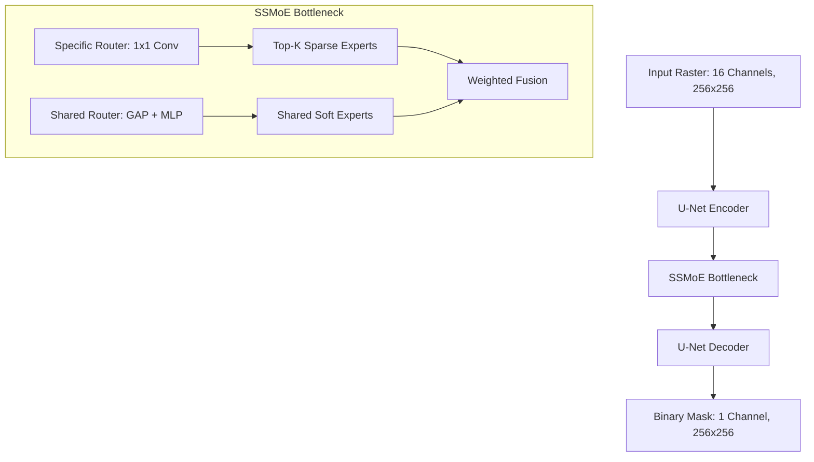
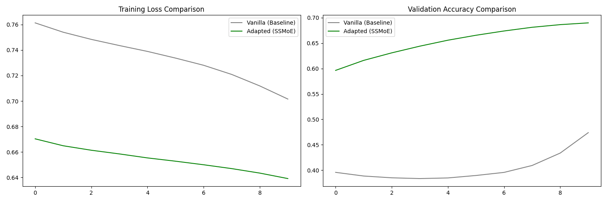

# Landslide-SSMoE: Spatial-Spectral Mixture of Experts for Landslide Detection

[](https://pytorch.org/) 
[](https://www.python.org/)

This repository implements **Landslide-SSMoE**, a novel adaptation of the **EEGMoE** (Specific and Shared Mixture-of-Experts) architecture for 2D geospatial landslide mask prediction. By decoupling domain-specific and domain-shared representations, the model enhances the segmentation of landslides from multi-channel satellite data (Sentinel-1, Sentinel-2, rainfall, and soil moisture).

## 🚀 Key Innovation: Specific & Shared MoE (SSMoE)

The core contribution is the **SSMoE Bottleneck**, which translates 1D signal-processing mechanisms (from the EEGMoE paper) into 2D spatial feature map processing:
- **Specific Expert Groups**: Utilizing Top-K sparse routing (Top-2) to handle domain-specific features related to distinct geographical regions or terrain types.
- **Shared Expert Groups**: Implementing soft-routing to extract universal spectral signatures and common landslide features across all domains.
- **2D Adaptation**: Replaced 1D Linear experts with 3x3 Convolutional layers and Linear routers with 1x1 Convolutional router maps for spatially-variant selection.

---

## 📊 Repository Structure

| Directory | Description |
| :--- | :--- |
| [`architecture/`](architecture/) | Core PyTorch implementation of `Adapted_SSMoE_UNet` and `SSMoE_ConvBlock`. |
| [`evaluation/`](evaluation/) | A/B testing framework, deconstruction reports, and training loops. |
| [`pipeline/`](pipeline/) | Data ingestion and preprocessing (Sentinel-1/2, Rainfall, Soil Moisture). |
| [`results/`](evaluation/results/) | Comparative plots and training metrics. |

---

## 🏗️ Architecture Overview



---

## 📈 Performance & Results

We conducted an A/B test comparing the **Adapted SSMoE U-Net** against a **Vanilla U-Net baseline**. Using identical seeds and hyperparameters, the results demonstrate the superior convergence and accuracy of the MoE-adapted architecture:



### Final Risk Assessment (Sample Predictions)
The model was evaluated on real-world regions (Wayanad, Puthumala) to assess landslide susceptibility:
- **Wayanad**: Max Predicted Risk: **0.1140**
- **Puthumala**: Max Predicted Risk: **0.0559**

---

## 🛠️ Getting Started

### Prerequisites
- Python 3.10+
- PyTorch 2.0+
- Rasterio
- Matplotlib, Numpy

### Installation
```bash
pip install torch rasterio matplotlib numpy
```

### Running the Experiment
To reproduce the A/B test results:
```bash
python evaluation/repro_experiment.py
```

---

## 📝 References
- *EEGMoE: A Domain-Decoupled Mixture-of-Experts Model for Self-Supervised EEG Representation Learning.*
- *Landslide Atlas of India, 2023 (ISRO/NRSC).*

---
© 2026 Team Rocket (nothariharan)
